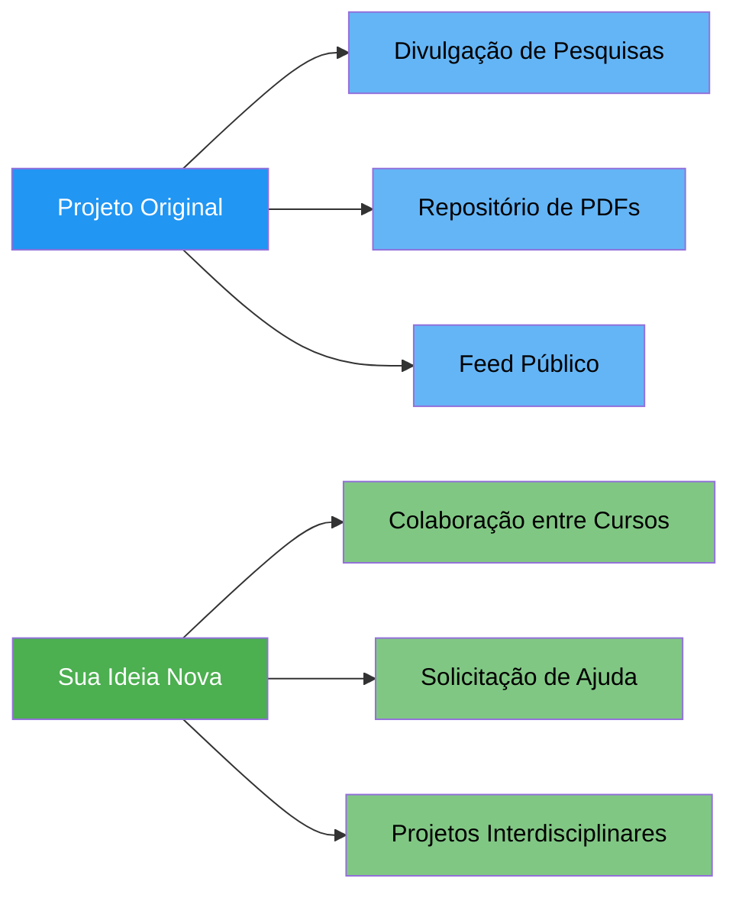

# Análise: Colaboração entre Cursos no Projeto Original

## 📋 Resumo da Análise

Após leitura completa do documento **"Projeto Luiz Claudio (Final).pdf"**, a conclusão é clara:

> [!IMPORTANT]
> O projeto original **NÃO contempla** a funcionalidade de colaboração entre cursos. A ideia que você descreveu — onde um aluno de Sistemas de Informação publica um projeto solicitando ajuda do curso de ADM — é uma **funcionalidade nova e original**, que não existe no escopo atual do documento.

---

## 🔍 O Que o Projeto Original Propõe

O documento descreve uma **"Plataforma para Divulgação de Pesquisas de Extensão"** com escopo focado em:

| Funcionalidade | Descrição |
|---|---|
| Upload de PDFs | Alunos autenticados (matrícula ativa) fazem upload de pesquisas em PDF |
| Feed público | Exibição de título, resumo, autores, link para download e imagem ilustrativa |
| Filtros de pesquisa | Por área de conhecimento, orientador/aluno e palavras-chave |
| Autenticação institucional | Login via matrícula institucional |
| Repositório de arquivos | Sistema de pastas para organização dos PDFs |

### Fluxo de Uso Descrito no Documento
1. Usuário faz login
2. Clica em "Fazer post"
3. Preenche formulário (título, resumo, nome do aluno, orientador)
4. Opcionalmente acrescenta outros envolvidos, PDF e imagem
5. Post é publicado e visível no feed

---

## 🚫 O Que o Projeto Original EXCLUI Explicitamente

O documento lista na seção **2.2 - Exclusões do Escopo**:

- ❌ Mensagens entre usuários
- ❌ Chat com pesquisadores
- ❌ Comentários ou curtidas
- ❌ Publicação anônima

> [!NOTE]
> A exclusão explícita de "mensagens entre usuários" e "chat com pesquisadores" mostra que o projeto original **descarta intencionalmente** qualquer forma de comunicação/colaboração direta entre usuários.

---

## 🆕 Sua Ideia: O Que NÃO Existe no Documento

A funcionalidade que você descreveu envolve conceitos que **não aparecem em nenhum lugar** do documento original:

| Conceito Novo | Presente no Doc? |
|---|---|
| Colaboração entre cursos diferentes | ❌ Não |
| Solicitação de ajuda de outro curso | ❌ Não |
| Identificação de curso do aluno | ❌ Não |
| Projetos interdisciplinares | ❌ Não |
| Status de "procurando colaboradores" | ❌ Não |
| Conexão entre áreas de conhecimento via projetos | ❌ Não |
| Matchmaking entre cursos | ❌ Não |

---

## 💡 Onde Existem "Ganchos" no Projeto Original

Embora a colaboração entre cursos não exista, há elementos no documento que podem servir de **base para essa expansão**:

### 1. Associação de Múltiplos Participantes
> *"Opção de inclusão com associação entre usuários participantes do projeto"*
> *"Acrescenta outros envolvidos – alunos e/ou orientadores (Opcional)"*

Isso mostra que o sistema já prevê projetos com **múltiplos participantes**, mas sem distinção de curso.

### 2. Filtro por Área de Conhecimento
> *"Filtro por área de conhecimento (Saúde, Tecnologia, Educação, etc)"*

Já existe a noção de **áreas distintas**, mas usada apenas como filtro de busca, não como mecanismo de colaboração.

### 3. Cultura de Compartilhamento
> *"Estimula a cultura de compartilhamento do conhecimento"*
> *"Engajamento dos alunos em práticas de desenvolvimento colaborativo"*

O documento menciona "compartilhamento" e "desenvolvimento colaborativo" como **valores**, mas não implementa funcionalidades concretas para isso.

### 4. Visibilidade Institucional
> *"Contribui com a visibilidade institucional perante a sociedade"*
> *"Aproxima a comunidade externa dos projetos de extensão"*

O foco é visibilidade **para fora**, não colaboração **interna** entre cursos.

---

## 🎯 Conclusão

O projeto original é essencialmente um **repositório digital + feed de divulgação** — um canal de publicação de mão única. A sua ideia transforma isso em uma **plataforma de colaboração ativa**, onde os cursos do IFF podem:

1. **Publicar projetos com demandas específicas** (ex: "Preciso de ajuda do curso de ADM")
2. **Sinalizar quais competências de outros cursos são necessárias**
3. **Promover a interdisciplinaridade** de forma orgânica

Essa é uma **evolução significativa** do escopo original e pode ser o **diferencial do seu TCC** em relação ao projeto da disciplina de Gerência de Projetos.

> [!TIP]
> Essa funcionalidade de colaboração entre cursos seria uma contribuição original sua ao projeto, não algo que já estava previsto. Isso é **ótimo para o TCC**, pois demonstra capacidade de identificar lacunas e propor soluções inovadoras.
