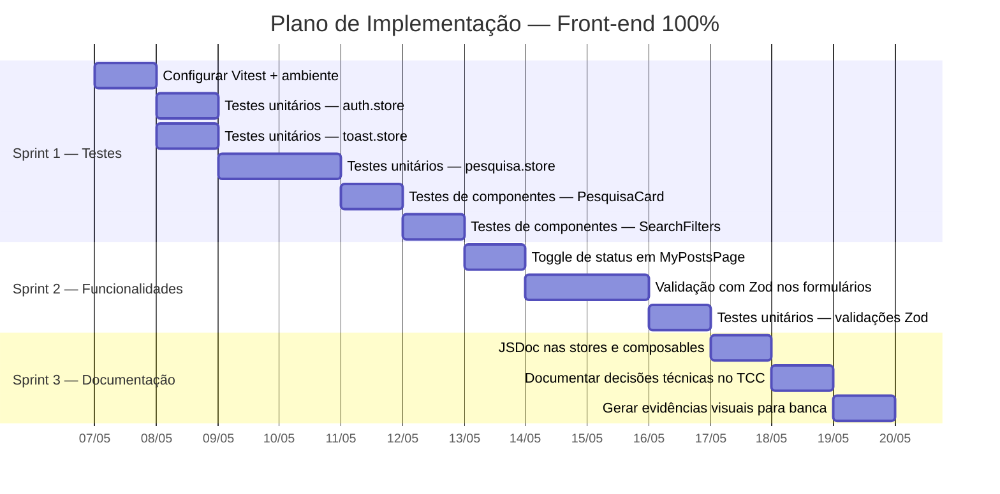
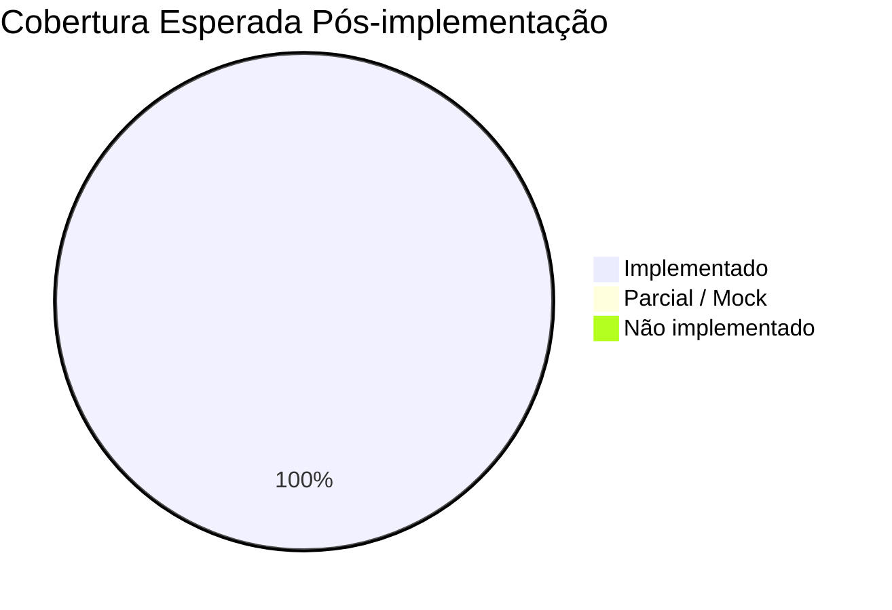

# Plano de Implementação — Front-end 100%

**Objetivo:** Fechar todas as lacunas identificadas no `frontend_compliance_report.md` e atingir cobertura total dos requisitos previstos nos documentos base do TCC.

**Projeto:** IFF Pesquisas — Front-end Vue 3 + TypeScript  
**Data de criação:** 06/05/2026  
**Baseline de cobertura atual:** ~85% (28 ✅ · 5 ⚠️ · 3 ❌)  
**Meta:** 100% — 36/36 itens ✅

---

## Visão Geral das Sprints



---

## Sprint 1 — Testes Automatizados

> [!IMPORTANT]
> Esta é a lacuna mais crítica do projeto. Testes automatizados são o **objetivo específico nº 8** do Plano Executivo e ocupam a **Semana 9 inteira** do cronograma. A ausência deles pode ser questionada pela banca.

### Tarefa 1.1 — Configurar Vitest + Vue Test Utils

**Prioridade:** 🔴 Crítica  
**Objetivo vinculado:** Plano Executivo §7.1 (stack) + §4.2 objetivo 8  
**Estimativa:** ~1h

**O que fazer:**
- [ ] Instalar dependências: `vitest`, `@vue/test-utils`, `@pinia/testing`, `happy-dom`
- [ ] Criar arquivo `vitest.config.ts` na raiz do frontend
- [ ] Adicionar script `"test": "vitest"` e `"test:run": "vitest run"` no `package.json`
- [ ] Criar pasta `frontend/src/__tests__/` para organizar os testes
- [ ] Criar helper `frontend/src/__tests__/setup.ts` com configuração global (Pinia mock, router mock)
- [ ] Executar `npm run test:run` para validar que a infra funciona

**Critério de aceite:** O comando `npm run test:run` executa sem erros, mesmo com 0 testes.

---

### Tarefa 1.2 — Testes unitários: `auth.store.ts`

**Prioridade:** 🔴 Crítica  
**Objetivo vinculado:** Plano Executivo §11.1 (critérios de aceitação: autenticação)  
**Estimativa:** ~1h  
**Arquivo de teste:** `frontend/src/__tests__/stores/auth.store.spec.ts`

**Casos de teste a implementar:**

| # | Caso | Comportamento esperado |
|---|---|---|
| 1 | Login com e-mail **não** `@iff.edu.br` | Retorna `false`, `erro` = `"Use seu e-mail institucional (@iff.edu.br)."` |
| 2 | Login com senha < 4 caracteres | Retorna `false`, `erro` = `"A senha deve ter no mínimo 4 caracteres."` |
| 3 | Login dev com credenciais válidas | Retorna `true`, `token` = `"dev-token"`, `usuario` preenchido |
| 4 | `isAutenticado` é `true` após login | Computed reativo funciona |
| 5 | Logout limpa `usuario`, `token` e `localStorage` | Estado resetado |
| 6 | `carregarUsuarioSalvo` restaura sessão do `localStorage` | Dados restaurados corretamente |
| 7 | `extrairNomeDev` formata corretamente `joao.silva@iff.edu.br` | Retorna `"Joao Silva"` |

**Critério de aceite:** 7 testes passando com `npm run test:run`.

---

### Tarefa 1.3 — Testes unitários: `toast.store.ts`

**Prioridade:** 🟡 Média  
**Estimativa:** ~30min  
**Arquivo de teste:** `frontend/src/__tests__/stores/toast.store.spec.ts`

**Casos de teste:**

| # | Caso | Comportamento esperado |
|---|---|---|
| 1 | `notificar()` adiciona toast à lista | `toasts.length === 1` |
| 2 | Toast é removido automaticamente após duração | Após timeout, `toasts.length === 0` |
| 3 | `remover()` remove toast específico | Toast com ID específico some |
| 4 | Múltiplos toasts coexistem | Lista comporta N toasts |
| 5 | Toast com `duracao = 0` persiste indefinidamente | Não é removido automaticamente |

**Critério de aceite:** 5 testes passando.

---

### Tarefa 1.4 — Testes unitários: `pesquisa.store.ts`

**Prioridade:** 🔴 Crítica  
**Objetivo vinculado:** Plano Executivo §11.2 (critérios de feed e busca)  
**Estimativa:** ~2h  
**Arquivo de teste:** `frontend/src/__tests__/stores/pesquisa.store.spec.ts`

**Casos de teste:**

| # | Caso | Comportamento esperado |
|---|---|---|
| 1 | Store inicializa com pesquisas mock | `todasPesquisas.length === 12` |
| 2 | Filtro por **área** retorna apenas pesquisas da área | Filtrando "Tecnologia" → 3 resultados |
| 3 | Filtro por **termo** busca em título, resumo e palavras-chave | Termo "Arduino" → encontra pesquisa de irrigação |
| 4 | Filtro por **autor** funciona case-insensitive | "maria" → encontra "Maria Clara Santos" |
| 5 | Filtro por **orientador** funciona | "Camila" → encontra pesquisa de educação ambiental |
| 6 | **Filtros combinados** (área + termo) | Interseção correta |
| 7 | **Paginação** respeita limite de 6 por página | Página 1 = 6 itens, página 2 = restante |
| 8 | `criarPesquisa()` adiciona pesquisa no início da lista | `todasPesquisas[0].titulo === "Nova pesquisa"` |
| 9 | `atualizarPesquisa()` modifica pesquisa existente | Título atualizado |
| 10 | `atualizarPesquisa()` preserva imagem quando não alterada | `imagemUrl` mantida |
| 11 | `deletarPesquisa()` remove pesquisa da lista | `todasPesquisas.length === 11` |
| 12 | `resetarFiltros()` limpa todos os filtros | `filtros === {}`, `pagina === 1` |

**Critério de aceite:** 12 testes passando.

---

### Tarefa 1.5 — Testes de componente: `PesquisaCard.vue`

**Prioridade:** 🟡 Média  
**Estimativa:** ~1h  
**Arquivo de teste:** `frontend/src/__tests__/components/PesquisaCard.spec.ts`

**Casos de teste:**

| # | Caso | Comportamento esperado |
|---|---|---|
| 1 | Renderiza título da pesquisa | Texto do título visível no DOM |
| 2 | Renderiza nome do autor e orientador | Ambos presentes |
| 3 | Exibe badge de PDF quando `pdfUrl` disponível | Ícone de PDF visível |
| 4 | **Não** exibe badge de PDF quando `pdfUrl` é vazio | Ícone ausente |
| 5 | Exibe imagem de capa com `loading="lazy"` | Atributo presente |
| 6 | Link "Ver detalhes" aponta para `/pesquisa/:id` | `href` correto |
| 7 | Exibe palavras-chave (máx. 3) | Até 3 keywords renderizadas |

**Critério de aceite:** 7 testes passando.

---

### Tarefa 1.6 — Testes de componente: `SearchFilters.vue`

**Prioridade:** 🟡 Média  
**Estimativa:** ~1h  
**Arquivo de teste:** `frontend/src/__tests__/components/SearchFilters.spec.ts`

**Casos de teste:**

| # | Caso | Comportamento esperado |
|---|---|---|
| 1 | Renderiza campo de busca com id `search-input` | Input presente |
| 2 | Renderiza select de áreas com opções corretas | 8 áreas + opção "Todas" |
| 3 | Emite evento ao digitar no campo de busca | `v-model` atualiza |
| 4 | Botão "Limpar filtros" dispara evento `limpar` | Evento emitido |
| 5 | Exibe contagem de resultados | Texto com total visível |

**Critério de aceite:** 5 testes passando.

---

## Sprint 2 — Funcionalidades Pendentes

### Tarefa 2.1 — Toggle de status (pública ↔ rascunho) em `MyPostsPage`

**Prioridade:** 🟠 Alta  
**Objetivo vinculado:** Plano Executivo §9 Semana 7 ("Ação de arquivar/despublicar")  
**Estimativa:** ~1h

**O que fazer:**

- [ ] Em `pesquisa.store.ts`:
  - Criar action `alternarStatus(id: string)` que alterna entre `'publica'` e `'rascunho'`
- [ ] Em `MyPostsPage.vue`:
  - Adicionar botão de toggle ao lado dos botões "Ver", "Editar" e "Excluir"
  - Ícone: olho aberto (pública) / olho fechado (rascunho)
  - Texto dinâmico: "Despublicar" quando pública, "Publicar" quando rascunho
  - Feedback via toast após alteração
- [ ] Em `FeedPage.vue` / `pesquisa.store.ts`:
  - Filtrar pesquisas com `status !== 'publica'` do feed público (apenas o autor vê rascunhos em "Meus Posts")
- [ ] Criar teste unitário para `alternarStatus()` na store

**Critério de aceite:**
- Botão visível em cada card de "Meus Posts"
- Toggle alterna status e exibe toast
- Pesquisa em rascunho **não** aparece no feed público
- 2 testes passando para a nova action

---

### Tarefa 2.2 — Substituir validações manuais por Zod

**Prioridade:** 🟡 Média  
**Objetivo vinculado:** Plano Executivo §7.1 (stack prevista: VeeValidate + Zod)  
**Estimativa:** ~2h

> [!NOTE]
> O plano previa VeeValidate + Zod. Como as validações já funcionam, a proposta é adotar **apenas Zod** (validação de schemas) sem VeeValidate, evitando complexidade desnecessária. A decisão de não usar VeeValidate será documentada.

**O que fazer:**

- [ ] Instalar `zod`: `npm install zod`
- [ ] Criar arquivo `frontend/src/schemas/index.ts` com os schemas:
  - `loginSchema` — email obrigatório `@iff.edu.br`, senha mínimo 4 chars
  - `createPostSchema` — título obrigatório (max 200), resumo obrigatório (max 500), área obrigatória, orientador obrigatório, palavras-chave (array max 5)
  - `recoverPasswordSchema` — email obrigatório `@iff.edu.br`
- [ ] Refatorar `auth.store.ts` → usar `loginSchema.safeParse()` no método `login()`
- [ ] Refatorar `CreatePostPage.vue` → usar `createPostSchema.safeParse()` no `handleSubmit()`
- [ ] Refatorar `RecoverPasswordPage.vue` → usar `recoverPasswordSchema.safeParse()`
- [ ] Manter mensagens de erro em português, extraindo-as do resultado do Zod

**Critério de aceite:**
- Validações funcionam identicamente ao comportamento atual
- Schemas centralizados em `schemas/index.ts`
- Nenhuma regressão no build (`npm run build` passa)

---

### Tarefa 2.3 — Testes unitários para schemas Zod

**Prioridade:** 🟡 Média  
**Estimativa:** ~30min  
**Arquivo de teste:** `frontend/src/__tests__/schemas/schemas.spec.ts`

**Casos de teste:**

| # | Caso | Comportamento esperado |
|---|---|---|
| 1 | `loginSchema` rejeita email fora de `@iff.edu.br` | `success === false` |
| 2 | `loginSchema` rejeita senha < 4 chars | `success === false` |
| 3 | `loginSchema` aceita credenciais válidas | `success === true` |
| 4 | `createPostSchema` rejeita título vazio | `success === false` |
| 5 | `createPostSchema` rejeita título > 200 chars | `success === false` |
| 6 | `createPostSchema` aceita formulário completo válido | `success === true` |
| 7 | `createPostSchema` rejeita mais de 5 palavras-chave | `success === false` |

**Critério de aceite:** 7 testes passando.

---

## Sprint 3 — Documentação e Fechamento

### Tarefa 3.1 — JSDoc nas stores e composables

**Prioridade:** 🟢 Baixa  
**Objetivo vinculado:** Plano Executivo §9 Semana 10 ("Documentação técnica")  
**Estimativa:** ~1h

**O que fazer:**

- [ ] Adicionar JSDoc em todas as funções exportadas de:
  - `auth.store.ts` — `login()`, `logout()`, `carregarUsuarioSalvo()`
  - `pesquisa.store.ts` — `buscarPesquisas()`, `buscarPorId()`, `criarPesquisa()`, `atualizarPesquisa()`, `deletarPesquisa()`
  - `toast.store.ts` — `notificar()`, `remover()`
  - `useAuth.ts` — composable wrapper
- [ ] Adicionar JSDoc nos tipos de `types/index.ts`
- [ ] Adicionar JSDoc nos schemas Zod de `schemas/index.ts`

**Formato:**
```typescript
/**
 * Realiza login institucional com validação de domínio e tamanho de senha.
 * Em ambiente de desenvolvimento (sem API), utiliza login simulado.
 *
 * @param payload - Credenciais com email e senha
 * @returns `true` se autenticado com sucesso, `false` caso contrário
 */
```

**Critério de aceite:** Todas as funções públicas documentadas. Nenhum erro no `vue-tsc`.

---

### Tarefa 3.2 — Documentar decisões técnicas

**Prioridade:** 🟡 Média  
**Objetivo vinculado:** Plano Executivo §9 Semana 10  
**Estimativa:** ~1h

**O que fazer:**

- [ ] Criar/atualizar `Docs/DECISOES_TECNICAS.md` com:
  - **Mock-first:** Por que o front opera com dados locais e como está preparado para API real (`api.ts`, interceptors, variáveis de ambiente)
  - **Zod sem VeeValidate:** Justificativa de usar apenas Zod para schemas, sem adicionar camada de form-binding por simplicidade
  - **CSS com design tokens vs. framework CSS:** Por que se optou por CSS puro com custom properties ao invés de Tailwind/Vuetify
  - **Composition API + `<script setup>`:** Justificativa da abordagem moderna do Vue 3
  - **Sistema de repositórios:** Menção de que o módulo de repositórios do projeto original é escopo do back-end e será integrado futuramente

**Critério de aceite:** Documento legível e referenciável no texto do TCC.

---

### Tarefa 3.3 — Gerar evidências visuais para a banca

**Prioridade:** 🟡 Média  
**Objetivo vinculado:** Plano Executivo §9 Semana 10 ("Evidências para banca")  
**Estimativa:** ~1h

**O que fazer:**

- [ ] Capturar screenshots de cada fluxo principal (mínimo 10):
  1. Home page (desktop + mobile)
  2. Feed com pesquisas carregadas
  3. Filtros ativos com resultados filtrados
  4. Skeleton/loading durante busca
  5. Página de detalhes de pesquisa
  6. Tela de login (com erro de validação)
  7. Formulário de criação de post (preenchido)
  8. Meus posts com botões de ação
  9. Dark mode ativo
  10. Tela de recuperação de senha
- [ ] Gravar vídeo de demonstração (~2-3 min) cobrindo:
  - Login → Criar post → Ver no feed → Filtrar → Detalhar → Compartilhar → Editar → Excluir → Dark mode → Ctrl+K
- [ ] Capturar screenshot do terminal com resultado dos testes (`npm run test:run`)
- [ ] Salvar tudo em `Docs/evidencias/`

**Critério de aceite:** Pasta `Docs/evidencias/` com ≥10 screenshots + 1 vídeo + 1 screenshot de testes.

---

## Resumo de Entregas por Sprint

| Sprint | Tarefas | Testes adicionados | Duração estimada |
|---|---|---|---|
| **Sprint 1** — Testes | 6 tarefas | ~36 testes | ~6h |
| **Sprint 2** — Funcionalidades | 3 tarefas | ~9 testes | ~3.5h |
| **Sprint 3** — Documentação | 3 tarefas | 0 | ~3h |
| **Total** | **12 tarefas** | **~45 testes** | **~12.5h** |

---

## Checklist de Conclusão (DoD — Definition of Done)

Ao final de todas as sprints, o front-end será considerado 100% quando:

- [ ] `npm run build` compila sem erros
- [ ] `npx vue-tsc --noEmit` passa sem erros
- [ ] `npm run test:run` executa ≥45 testes, todos passando
- [ ] Toggle de status funciona em "Meus Posts" (pública ↔ rascunho)
- [ ] Validações usam schemas Zod centralizados
- [ ] JSDoc presente em todas as stores, composables e types
- [ ] Documento de decisões técnicas criado
- [ ] Pasta de evidências visuais com ≥10 screenshots + vídeo

---

## Mapa de Conformidade Final Esperado



> [!TIP]
> Após a execução deste plano, **todos os 36 itens** dos documentos base estarão cobertos. O único item que continuará como "mock-first" é a integração com API real, que está **fora do escopo** do TCC de front-end mas com a infraestrutura 100% preparada (`api.ts` + interceptors + variáveis de ambiente).
